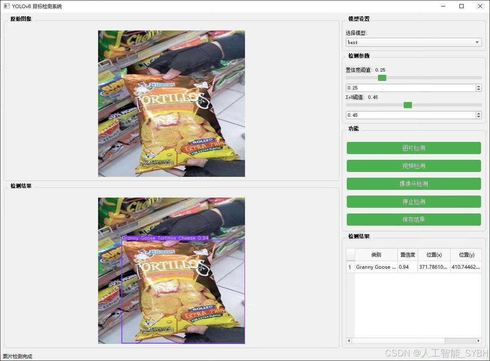
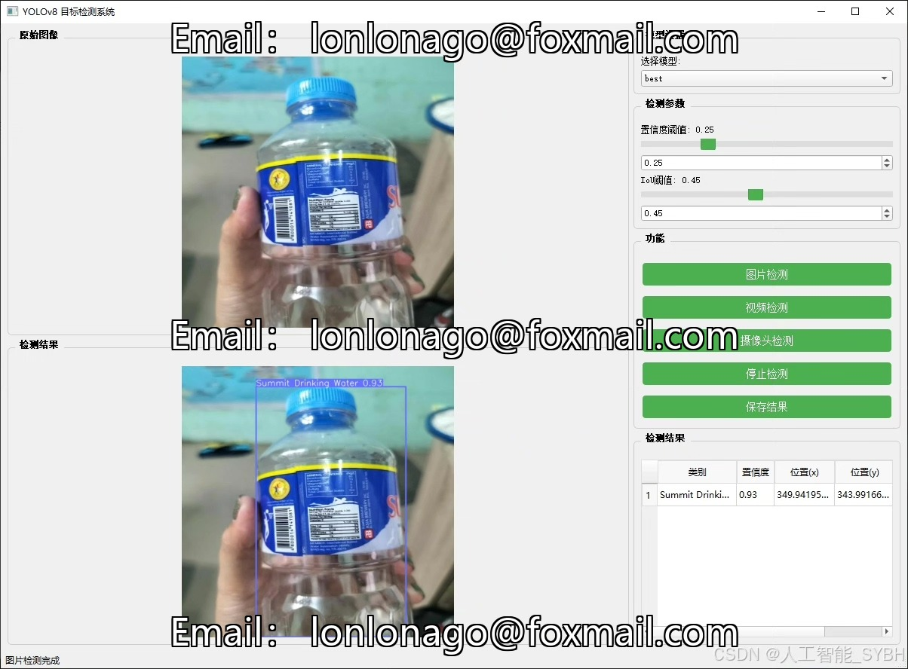
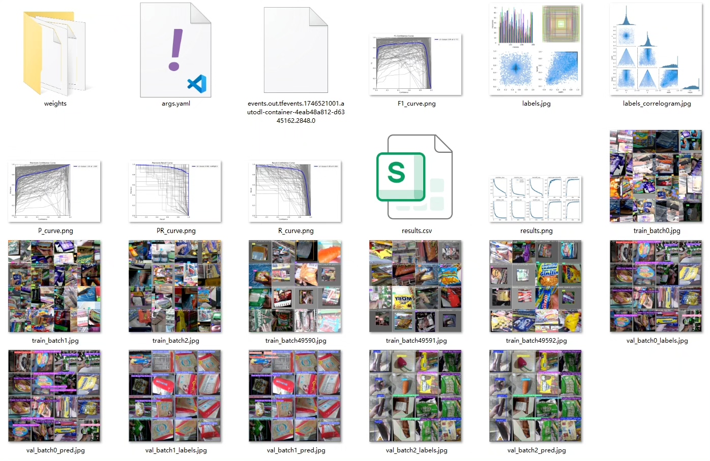
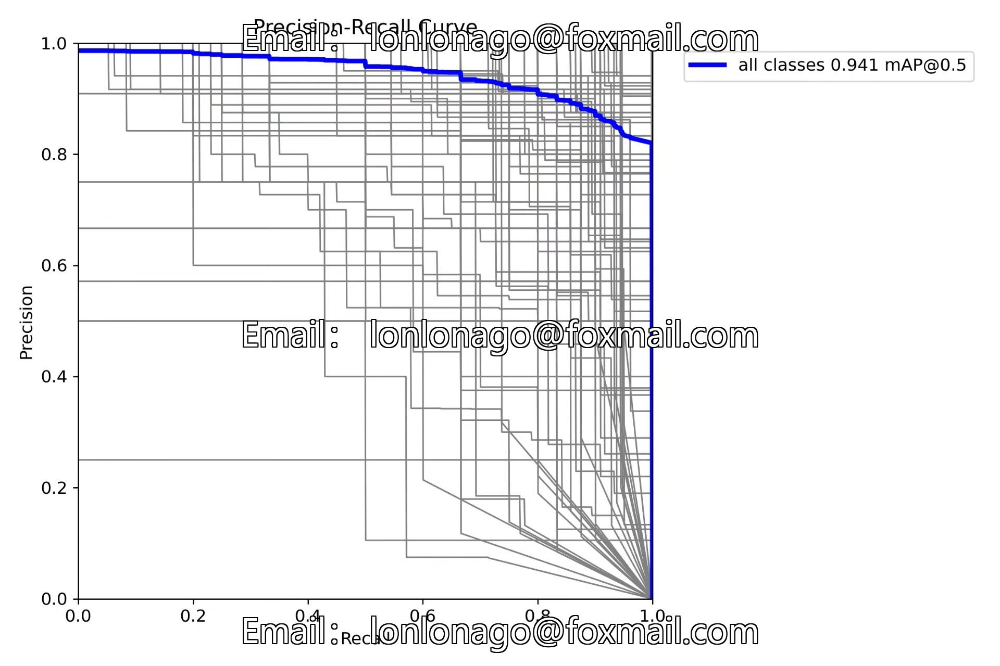
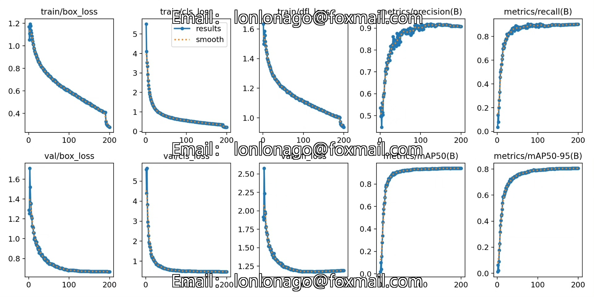
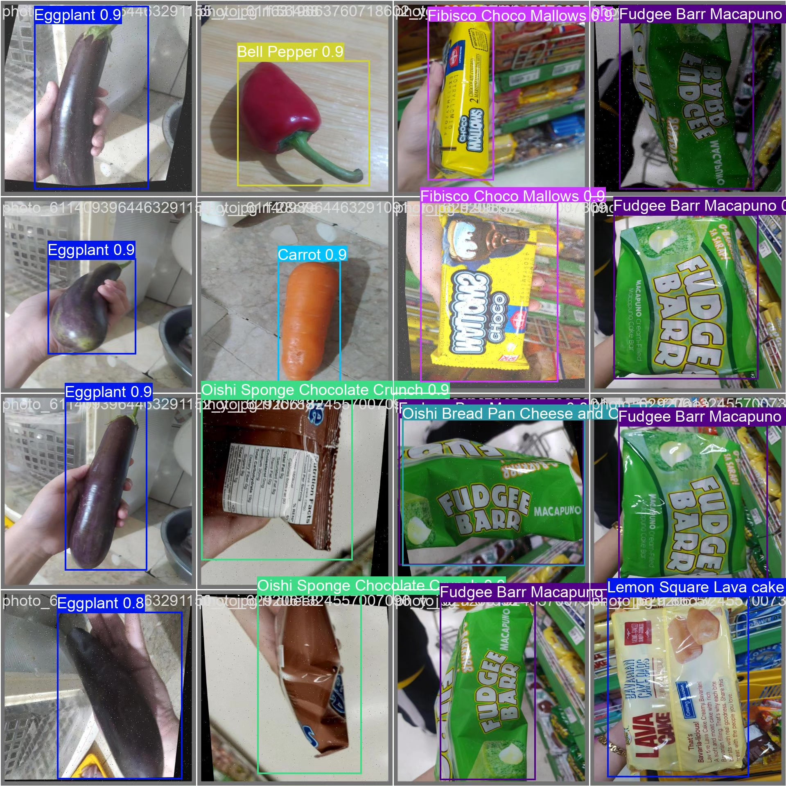
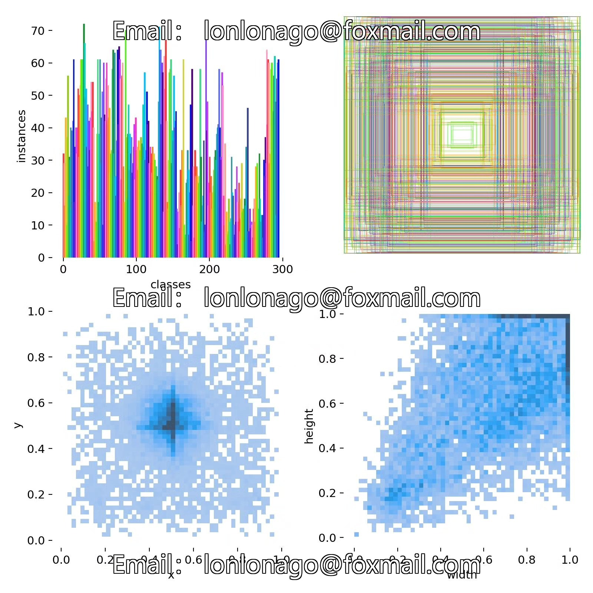
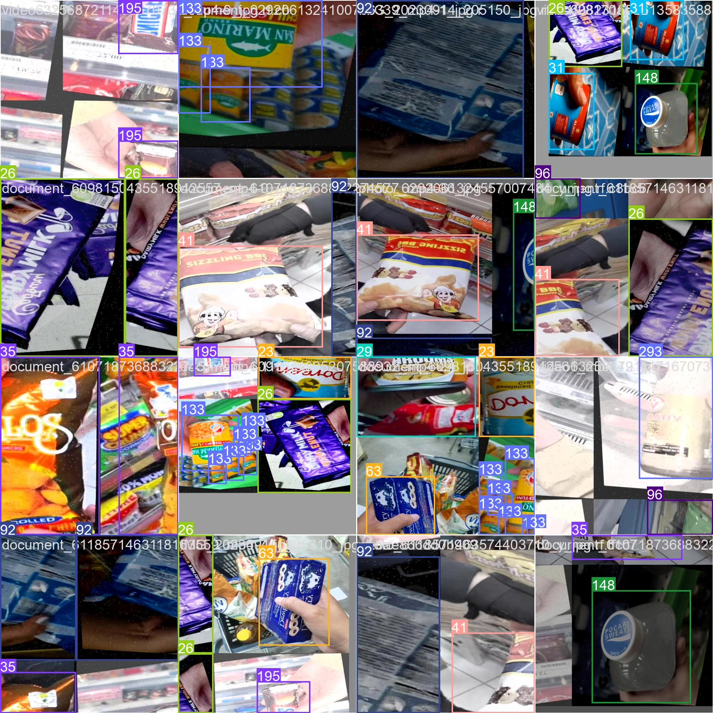

# Based on deep learning YOLOv8, supermarket product recognition detection system

## Body

This project is based on the YOLOv8 deep learning framework to develop an advanced supermarket product recognition and detection system. It aims to achieve precise recognition and localization of 295 different products in supermarket environments. The system has been trained on a large-scale dataset, including 8336 training images and 2163 validation images, covering a wide range of product categories from food and beverages to daily necessities. The system can detect products on shelves in real time, accurately recognize products such as "Nestlé Caffè Mocha Latte Double Pack", "Green Chili", "Rebisco Chocolate Cookies", "Tomatoes", and even differentiate between similar-packaging products with different flavors (such as "Granny Goose Tortillos Cheese" and "Granny Goose Tortillos Chili"). This system utilizes the latest computer vision technology, achieving industry-leading accuracy in product recognition, detection speed, and system stability. It provides strong technical support for the intelligent transformation of the retail industry.

The company's products have obtained YOLO official commercial license certification.

We offer after-sales service.

After payment, we will provide WeChat ID for any questions.

Environment configuration: We will provide a tutorial on environment configuration, and WeChat will provide answers.

Remote installation service: If you need remote configuration, an additional fee of 69 is required,
failure in configuration will result in all fees being refunded (only installation fee for old computers)

Retraining dataset: After setting up the environment, you can train on your own computer.
If you need us to retrain, just pay 69 + computing power fee (2.5 yuan/hour)

## Images

## Payment

Here is a pay link on Stripe ( https://buy.stripe.com/3cs8yP7sY87d0vu9AB ). Please contact me lonlonago@foxmail.com after funding $89, and I will send you a complete data files , thank you!

